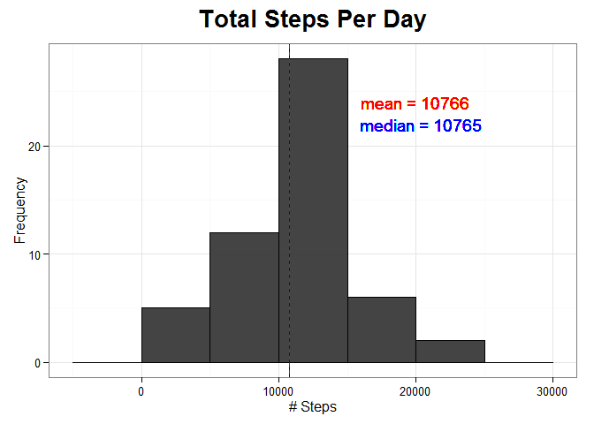
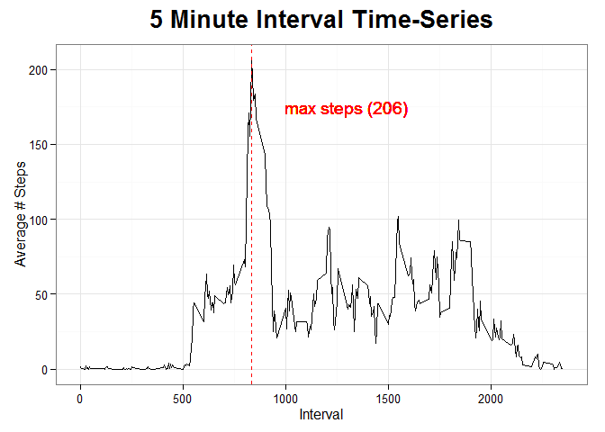
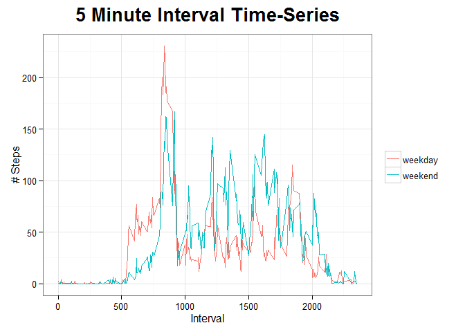

# Reproducible Research: Peer Assessment 1

Kory Becker - June 3, 2015

## Introduction

The following is an analysis of the data recorded from a personal activity monitoring device (ie., Fitbit, Nike Fuelband, etc), as part of a project for the Reproducbile Research class by Johns Hopkins University via Coursera. The analysis data was collected at 5-minute intervals throughout a series of days, spanning the months of October and November 2012.

For this analysis, we'll load the data set, pre-process and clean the data, and analyze key metrics that summarize the overall data collected. These metrics include finding the mean total number of steps taken per day, the average daily activity pattern, and determining which 5-minute interval, on average, includes the most steps, and determining differences between weekday and weekend activity.

Let's get started!

Note: When running the code, be sure to set the working directory location. In R-Studio, select Session->Set Working Directory->To Source File Location.

## Required libraries.

Before we get started, we'll need to include the required plotting libraries. The following code includes ggplot2 in the project.


```r
## Including the required R packages.
packages <- c("ggplot2", "gridExtra")
if (length(setdiff(packages, rownames(installed.packages()))) > 0) {
  install.packages(setdiff(packages, rownames(installed.packages())))  
}

library(ggplot2)
library(gridExtra)
```

```
## Loading required package: grid
```

## Loading and preprocessing the data.

The first step in our data analysis is to load the recorded data from a csv file. As the csv file is zipped, we'll need to first unzip the file, extract the csv, and finally read the data into memory. We'll also remove rows with missing data, as shown in the following code:


```r
# Read csv file.
data <- read.csv(unz("activity.zip", "activity.csv"))

# Remove fields with missing data.
data2 <- data[!is.na(data$steps),]
```

## What is the mean total number of steps taken per day?

For our first data analysis question, we'll determine the mean total number of steps taken per day. This type of question can be best answered with a histogram chart. Note, the key [difference](http://stattrek.com/statistics/charts/histogram.aspx) between a histogram and a bar chart is that a histogram represents a distribution of numerical data, where each bar can be compared to the others. By contrast, a bar chart represents values for categorical variables. The X axis of a bar chart does not represent a low or high end value, as the X axis labels are categorical, not quantitative.

Let's start by calculating the total number of steps per day. We can use the aggregate function to do this. We can then calculate the mean of the total number of steps per day and use this to plot a vertical line on the histogram, marking the mean.


```r
# Calculate the total number of steps per day.
stepsPerDay <- aggregate(steps ~ date, data2, FUN=sum)

# Calculate the mean of the total number of steps per day.
stepsPerDayMean <- mean(stepsPerDay$steps)

# Calculate the median of the total number of steps per day.
stepsPerDayMedian <- median(stepsPerDay$steps)

# Draw histogram, set width of bars to 5000.
g1 <- ggplot(stepsPerDay, aes(x = steps))
g1 <- g1 + geom_histogram(binwidth=5000, fill='#303030', col='black', alpha=I(.9))
g1 <- g1 + ggtitle('Total Steps Per Day')
g1 <- g1 + theme_bw()
g1 <- g1 + theme(plot.title = element_text(size=20, face="bold", vjust=2))
g1 <- g1 + xlab('# Steps')
g1 <- g1 + ylab('Frequency')

# Include vertical line for mean.
g1 <- g1 + geom_vline(xintercept=stepsPerDayMean, col='red')

# Include vertical line for median.
g1 <- g1 + geom_vline(xintercept=stepsPerDayMedian, col='blue', linetype='dashed')

# Include labels.
g1t <- g1 + geom_text(aes(20000, 24, label=paste('mean = ', round(stepsPerDayMean), sep='')), col='red', size=5,  show_guide=FALSE)
g1t <- g1t + geom_text(aes(20400, 22, label=paste('median = ', round(stepsPerDayMedian), sep='')), col='blue', size=5, show_guide=FALSE)

print(g1t)
```

 

Note in the above code, we're using ggplot2 to draw a histogram chart. We've drawn a vertical line to represent the mean and median total number of steps per day. It's interesting to note that both the mean median are nearly identical in value.

    mean = 10766
    median = 10765

## What is the average daily activity pattern?

Next, we'll determine the average daily activity pattern by plotting a time series chart. We'll display the 5-minute intervals on the x-axis and the average number of steps taken, averaged across all days, on the y-axis.

To do this, we'll first calculate the average steps per interval, using the aggregate function. This is similar to the way we used the aggregate function above, with the difference of replacing 'date' with 'interval'.

We'll also determine which interval has the maximum number of steps. We can do this by simply checking for the max steps value within averageStepsPerInterval.


```r
# Calculate average steps per interval.
averageStepsPerInterval <- aggregate(steps ~ interval, data2, FUN=mean)

# Calculate the average 5-minute interval with the max number of steps.
maxStepsInterval <- averageStepsPerInterval[averageStepsPerInterval$steps == max(averageStepsPerInterval$steps),]

# Draw time-series line chart.
g <- ggplot(averageStepsPerInterval, aes(x = interval, y = steps))
g <- g + geom_line()
g <- g + ggtitle('5 Minute Interval Time-Series')
g <- g + xlab('Interval')
g <- g + ylab('Average # Steps')
g <- g + theme_bw()
g <- g + theme(plot.title = element_text(size=20, face="bold", vjust=2))

# Include vertical line for the interval with the max average steps.
g <- g + geom_vline(xintercept=maxStepsInterval$interval, col='red', linetype='dashed')

# Include labels.
g <- g + geom_text(aes(1300, 175, label=paste('max steps (', round(maxStepsInterval$steps), ')', sep='')), col='red', show_guide=FALSE)

print(g)
```

 

After running the above code, you can see that the interval with the maximum number of steps, on average across all days, is interval 835 with 206 steps.

         interval steps
    104  835      206.1698

## Inputing missing values.

So far, we've performed calculations on the cleaned data, with missing values (steps reported as NA) removed. More specifically, there are 17,568 rows in the original dataset, and only 15,264 rows after removing missing values. This leaves 2,304 rows of missing data that is unaccounted for. We can more clearly show this in a chart, as follows:


```r
allCount <- nrow(data)
cleanedCount <- nrow(data2)
missingCount <- allCount - cleanedCount

missingSummary <- data.frame(set = c('complete', 'cleaned', 'missing'), count = c(allCount, cleanedCount, missingCount))

qplot(missingSummary, x=missingSummary$set, y=missingSummary$count, geom='bar', stat='identity', main='Complete vs Missing Data', xlab='', ylab='# Rows') +
geom_text(aes(1, 1000, label=allCount), col='white', show_guide=FALSE) +
geom_text(aes(2, 1000, label=cleanedCount), col='white', show_guide=FALSE) +
geom_text(aes(3, 1000, label=missingCount), col='red', show_guide=FALSE) +
theme_bw() + 
theme(plot.title = element_text(size=20, face="bold", vjust=2))
```

 

    all 17568
    cleaned 15264
    missing 2304

# Filling missing values.

For the next step in our analysis, we'll fill in the missing data and try running the same reports as above to note any differences in the results. We'll simply use the mean number of steps for each interval, across all of the days, to fill in missing values. It helps that we've already calculated this value in averageStepsPerInterval.


```r
data3 <- data

# Replace NA values at each interval with the average steps for that interval.
x <- lapply(seq_along(data3$interval), function(i) {
  if (is.na(data[i, ]$steps)) {
    data3[i, ]$steps <<- averageStepsPerInterval[averageStepsPerInterval$interval == data3[i, 'interval'],]$steps
  }
})
```

With the missing values filled in, let's try plotting the histogram again. You'll find that this new chart looks quite familiar.


```r
# Calculate the total number of steps per day.
stepsPerDay <- aggregate(steps ~ date, data3, FUN=sum)

# Calculate the mean of the total number of steps per day.
stepsPerDayMean <- mean(stepsPerDay$steps)

# Calculate the median of the total number of steps per day.
stepsPerDayMedian <- median(stepsPerDay$steps)

# Draw histogram, set width of bars to 5000.
g2 <- ggplot(stepsPerDay, aes(x = steps))
g2 <- g2 + geom_histogram(binwidth=5000, fill='#303030', col='black', alpha=I(.9))
g2 <- g2 + ggtitle('Total Steps Per Day')
g2 <- g2 + theme_bw()
g2 <- g2 + theme(plot.title = element_text(size=20, face="bold", vjust=2))
g2 <- g2 + xlab('# Steps')
g2 <- g2 + ylab('Frequency')

# Include vertical line for mean.
g2 <- g2 + geom_vline(xintercept=stepsPerDayMean, col='red')

# Include vertical line for median.
g2 <- g2 + geom_vline(xintercept=stepsPerDayMedian, col='blue', linetype='dashed')

# Include labels.
g2t <- g2 + geom_text(aes(20000, 24, label=paste('mean = ', round(stepsPerDayMean), sep='')), col='red', size=5,  show_guide=FALSE)
g2t <- g2t + geom_text(aes(20400, 22, label=paste('median = ', round(stepsPerDayMedian), sep='')), col='blue', size=5,  show_guide=FALSE)

print(g2t)
```

 

# What is the impact of inputing missing data on the estimates of the total daily number of steps?

Let's take a look at the new chart, with missing values replaced, side-by-side with the original chart.


```r
# Arrange plots side-by-side for comparison.
grid.arrange(g1, g2, ncol=2)
```

 

As you can see in the side-by-side plots, the mean and median values remain nearly the same. In fact, the only noticeable difference between the original data and the data with missing values replaced, is the overall frequency (ie., number of observations). This can be seen in the center tallest bar, which has grown from about 27 to 36.


## Are there differences in activity patterns between weekdays and weekends?

Now, let's compare activity for weekdays versus weekends. We'll use the newly created dataset, containing filled-in values for the missing NA fields. We'll also need to add a new factor column to our dataset to indicate whether a date is a weekday or a weekend. We can do this with the following code:


```r
# Create a factor to indicate weekday (1) or weekend (2).
dayOfWeek <- factor(c(1:2), labels = c('weekday', 'weekend'))

# Setup the call to weekdays() to check if a date is a weekend.
dayOfWeekAbbr <- seq(Sys.Date()-10, Sys.Date(), by = 1)

# Add the new column to the dataset, default to weekday.
data3 <- cbind(data3, dayofweek = dayOfWeek[1])

# Find the list of rows that match a weekend (Sat, Sun) and set the dayofweek column to weekend.
data3[grepl("Sat|Sun", weekdays(as.Date(data3$date))),]$dayofweek <- dayOfWeek[2]

# Calculate average steps per interval.
averageStepsPerInterval <- aggregate(steps ~ interval + dayofweek, data3, FUN=mean)

g <- ggplot(averageStepsPerInterval, aes(interval, steps))
g <- g + geom_line(color='aquamarine4')
g <- g + facet_wrap(~dayofweek, nrow=2)
g <- g + ggtitle('5 Minute Interval Time-Series')
g <- g + xlab('Interval')
g <- g + ylab('# Steps')
g <- g + theme_bw()
g <- g + theme(plot.title = element_text(size=20, face="bold", vjust=2))

print(g)
```

 

The code above displays a panel plot, containing a 5-minute interval time series of the average number of steps taken, averaged across all weekday and weekend days, respectively.

The two charts tend to follow a similar pattern. Throughout the middle of the day, activity is higher. During weekdays, it is especially high at interval 835 (as determined earlier in this article). This may coorespond to walking to work or other elevated activity during the week at this time.

Although the weekdays have the highest average number of steps, the weekends have a higher average number of steps taken overall. This is easier to see if we overlay the time-series on top of each other, as shown below.


```r
g <- ggplot(averageStepsPerInterval, aes(interval, steps))
g <- g + geom_line(aes(color=averageStepsPerInterval$dayofweek), group = averageStepsPerInterval$dayofweek)
g <- g + ggtitle('5 Minute Interval Time-Series')
g <- g + xlab('Interval')
g <- g + ylab('# Steps')
g <- g + theme_bw()
g <- g + theme(legend.title = element_blank()) + scale_color_discrete(name="Day of week")
g <- g + theme(plot.title = element_text(size=20, face="bold", vjust=2))

print(g)
```

 

In this final plot, we can see the spike for the weekday at 835. However, there is a higher overall trend for the average number of steps taken during weekends. The data indicates this person is clearly more active on weekend days versus weekdays.

